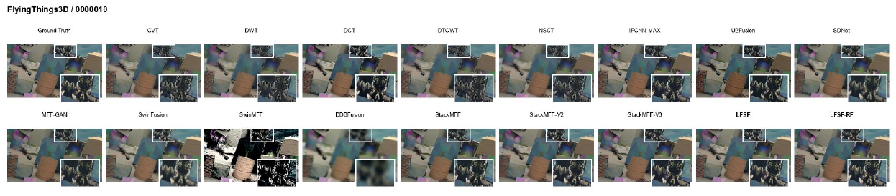

<div align="center">

# LFSF and LFSF-RF

### Latent-Focus Soft Fusion for Multi-Focus Image Stacks

Inference and evaluation code accompanying the submitted manuscript<br>
**"Latent-Focus Soft Fusion: Decoupling Focus Reasoning from Source-Pixel Synthesis for Multi-Focus Image Stacks"**

[](https://www.python.org/)
[](https://pytorch.org/)
[](tests/)
[](docs/INFERENCE_REPRODUCTION.md)
[](docs/REPAIR_REPORT.md)

[Overview](#overview) | [Model Zoo](#model-zoo) | [Quick Start](#quick-start) | [Data](#data-preparation) | [Evaluation](#evaluation) | [Citation](#citation)

</div>

> [!IMPORTANT]
> This is an **inference-only reviewer release**. It reproduces LFSF and
> LFSF-RF with frozen checkpoints. Training and synthetic-stack generation are
> outside the scope of this package.

## Overview

LFSF separates **where to focus** from **how to synthesize the fused image**:

- **Latent-focus scoring:** a shared 39,361-parameter scorer estimates spatial
  focus evidence from frozen VQ features and local gradient cues.
- **Source-pixel fusion:** one masked softmax is computed over the complete
  focus stack, then observed RGB pixels are fused directly.
- **Shortcut-free RF refinement:** LFSF-RF adds a one-step 838,275-parameter
  rectified-flow refiner without full RGB `F0` conditioning.
- **Strict paper protocol:** checkpoints, 230 benchmark scenes, native
  resolution, uint8 conversion, metrics, and aggregation are all validated.

<p align="center">
  
</p>

## Highlights

| Property | LFSF | LFSF-RF |
|---|---:|---:|
| Trainable/frozen release parameters | 39,361 | 838,275 refiner + frozen LFSF |
| Output construction | Weighted observed RGB pixels | `clip(F0 + velocity)` |
| Full-stack normalization | One masked softmax | Reuses LFSF |
| Paper checkpoint state | `focus_scorer` (6/6 tensors) | EMA `velocity_model` (73/73 tensors) |
| Primary role | Source-preserving fidelity anchor | Optional robustness-oriented refinement |

The parameter-matched **Direct** model is included only as a control; it is not
a proposed method.

## Qualitative Comparison

<p align="center">
  <a href="assets/qualitative_flyingthings3d.png">
    
  </a>
</p>

The release includes representative LFSF/LFSF-RF outputs under
`reproducibility/figure_sources/clean_predictions/` for all five benchmark
families.

## Reference Results

Full-reference evaluation uses uint8 BT.601 luminance, the complete image,
`data_range=255`, and no border crop.

| Dataset | Scenes | LFSF PSNR | LFSF SSIM | LFSF-RF PSNR | LFSF-RF SSIM |
|---|---:|---:|---:|---:|---:|
| Mobile Depth | 11 | 38.86 | 0.9799 | 36.29 | 0.9766 |
| Middlebury | 15 | 32.81 | 0.9546 | 34.68 | 0.9617 |
| FlyingThings3D | 100 | 34.07 | 0.9663 | 35.43 | 0.9712 |
| Road-MF | 80 | 38.26 | 0.9925 | 46.91 | 0.9981 |
| 4D-Light-Field | 24 | 27.02 | 0.8536 | 28.56 | 0.8713 |
| **Equal-dataset macro** | **230** | **34.21** | **0.9494** | **36.37** | **0.9558** |

The equal-dataset macro is the unweighted mean of the five dataset means, not
a pooled average over 230 scenes.

## Model Zoo

The paper checkpoints are included in [`checkpoints/`](checkpoints/).

| Model | Seed | Parameters | Checkpoint | SHA-256 prefix |
|---|---:|---:|---|---|
| LFSF | 3407 | 39,361 | [`lfsf_seed3407.pth`](checkpoints/lfsf_seed3407.pth) | `34310155` |
| LFSF-RF | 3407 | 838,275 | [`lfsf_rf_seed3407.pth`](checkpoints/lfsf_rf_seed3407.pth) | `44cf3bd8` |
| Direct control | 3407 | 838,275 | [`direct_seed3407.pth`](checkpoints/direct_seed3407.pth) | `907523ff` |

LFSF-RF and Direct default to the final EMA state (`velocity_model`). Full
hashes are recorded in [`checkpoints/checksums.txt`](checkpoints/checksums.txt).

### Frozen VQ Encoder

The fixed VQ encoder is distributed by
[RFfusion](https://github.com/zirui0625/RFfusion) and is not duplicated here.

1. Download [`autoencoder.ckpt`](https://drive.google.com/file/d/10Rmz6YtGnM2qHk1QfjCY9eEFkh0gsvVZ/view?usp=drive_link).
2. Place it at `checkpoints/autoencoder.ckpt`.
3. Verify the artifact:

```bash
python scripts/download_vq_encoder.py
```

Expected SHA-256:

```text
aacf13951f4b18f5af9b47febdc696cf9559305d6de0821084abeaf342439251
```

## Quick Start

### 1. Installation

```bash
git clone https://github.com/llihh/LFSF-RF.git
cd LFSF-RF

python -m venv .venv
source .venv/bin/activate
python -m pip install --upgrade pip
python -m pip install -r requirements.txt
python -m pip install -e .
```

Python 3.10+, PyTorch 2.0+, and an NVIDIA CUDA environment are recommended.

### 2. LFSF Inference

```bash
python scripts/infer_lfsf.py \
  --vae-ckpt checkpoints/autoencoder.ckpt \
  --data-root /path/to/test_datasets \
  --dataset FlyingThings3D \
  --output-dir outputs/lfsf/FlyingThings3D
```

### 3. LFSF-RF Inference

```bash
python scripts/infer_lfsf_rf.py \
  --vae-ckpt checkpoints/autoencoder.ckpt \
  --data-root /path/to/test_datasets \
  --dataset FlyingThings3D \
  --output-dir outputs/lfsf_rf/FlyingThings3D
```

Both commands enforce the official scene list, strict checkpoint loading,
native-resolution paper inference, uniform sampling to at most 24 frames, and
canonical GT resolution. The checkpoint's `image_size=256` is the **training
crop size**, not the benchmark inference resize.

## Data Preparation

The compatible benchmark preparation conventions and released stack resources
are documented by
[StackMFF-V2](https://github.com/Xinzhe99/StackMFF-V2#-data-preparation).
Datasets are not redistributed by this repository.

```text
test_datasets/
  <Dataset>/
    image stack/<scene>/<naturally sorted focal frames>
    AiF/<scene>.<png|jpg|...>
```

| Dataset | Official scene count | Scene list |
|---|---:|---|
| Mobile Depth | 11 | [`mobile_depth.txt`](data/scene_lists/mobile_depth.txt) |
| Middlebury | 15 | [`middlebury.txt`](data/scene_lists/middlebury.txt) |
| FlyingThings3D | 100 | [`flyingthings3d.txt`](data/scene_lists/flyingthings3d.txt) |
| Road-MF | 80 | [`road_mf.txt`](data/scene_lists/road_mf.txt) |
| 4D-Light-Field | 24 | [`4d_light_field.txt`](data/scene_lists/4d_light_field.txt) |

Inference fails explicitly on missing GT, missing frames, duplicate scenes, or
an incorrect scene count. See [`docs/DATASETS.md`](docs/DATASETS.md).

## Evaluation

### Full-Reference PSNR and SSIM

```bash
python scripts/evaluate_full_reference.py \
  --pred-dir outputs/lfsf/FlyingThings3D \
  --gt-dir /path/to/test_datasets/FlyingThings3D/AiF \
  --scene-list data/scene_lists/flyingthings3d.txt \
  --expected-scenes 100 \
  --dataset FlyingThings3D \
  --method LFSF \
  --output-csv results/per_scene/lfsf_FlyingThings3D.csv
```

### Extended Fusion Metrics

```bash
python scripts/evaluate_stack_metrics.py \
  --pred-dir outputs/lfsf/FlyingThings3D \
  --stack-root "/path/to/test_datasets/FlyingThings3D/image stack" \
  --scene-list data/scene_lists/flyingthings3d.txt \
  --expected-scenes 100 \
  --dataset FlyingThings3D \
  --method LFSF \
  --output-csv results/per_scene/lfsf_FlyingThings3D_extended.csv
```

The archived Table 3 protocol uses the naturally sorted first and last focal
planes for Qabf/VIF/MI; SF and AG use only the fused image. Details are in
[`docs/METRICS.md`](docs/METRICS.md).

### Tests and Real Smoke Test

```bash
pytest -q

python scripts/smoke_test.py \
  --vae-ckpt checkpoints/autoencoder.ckpt \
  --data-root /path/to/test_datasets \
  --dataset Middlebury \
  --scene Motorcycle \
  --device cuda:0
```

For all five datasets, use
[`scripts/reproduce_inference_metrics.py`](scripts/reproduce_inference_metrics.py).
The full protocol is documented in
[`docs/INFERENCE_REPRODUCTION.md`](docs/INFERENCE_REPRODUCTION.md).

## Repository Structure

```text
LFSF-RF/
|-- assets/                 # README architecture and qualitative figures
|-- checkpoints/            # Frozen LFSF, LFSF-RF, and Direct weights
|-- configs/                # Artifact, dataset, VQ, and evaluation configs
|-- data/scene_lists/       # Authoritative 230-scene benchmark protocol
|-- docs/                   # Reproduction, metrics, datasets, and audit notes
|-- reproducibility/        # Archived tables, metrics, and representative outputs
|-- scripts/                # Inference, evaluation, statistics, and smoke CLIs
|-- src/lfsf/               # Models, full-stack inference, metrics, and utilities
`-- tests/                  # Checkpoint, masking, metric, and model-contract tests
```

## Reproducibility Scope

| Item | This release |
|---|---|
| LFSF and LFSF-RF frozen inference | Supported |
| Proposed rows in Tables 1-3 | Supported |
| Table 4 paired statistics | Supported when baseline per-scene artifacts are supplied |
| Training and synthetic stack generation | Not included |
| Table 5 ablations / Table 6 profiling / three-seed training | Archived evidence only |

Precomputed CSVs are evidence artifacts and are never used as inputs to a fresh
metric run.

## Citation

The manuscript is submitted and is not represented here as an accepted or
published Neurocomputing article.

```bibtex
@article{li2026lfsf,
  title   = {Latent-Focus Soft Fusion: Decoupling Focus Reasoning from
             Source-Pixel Synthesis for Multi-Focus Image Stacks},
  author  = {Li, Hao and Zhang, Shengjiang and Yao, Kang and Dong, Ting and
             Zhang, Yang and Fu, Weiwei},
  year    = {2026},
  note    = {Manuscript submitted for review}
}
```

## Acknowledgements

- [RFfusion](https://github.com/zirui0625/RFfusion): frozen VQ-VAE architecture
  and pretrained encoder artifact. Please cite *Efficient Rectified Flow for
  Image Fusion* when using this checkpoint.
- [StackMFF-V2](https://github.com/Xinzhe99/StackMFF-V2#-data-preparation):
  benchmark preparation conventions and released multi-focus stack resources.
- [CompVis latent-diffusion](https://github.com/CompVis/latent-diffusion) and
  [taming-transformers](https://github.com/CompVis/taming-transformers):
  minimal vendored VQ implementation.

Upstream projects are not claimed as part of the LFSF authors' original work.
See [`third_party/README.md`](third_party/README.md) for attribution details.

## License

The authors' code license is pending final approval. Bundled third-party
components retain their original terms. The external VQ checkpoint and
benchmark datasets remain governed by their respective upstream releases.
