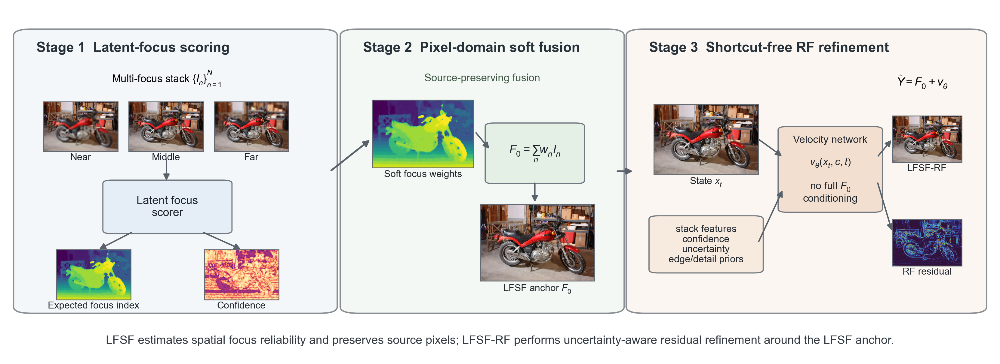

<div align="center">

# LFSF and LFSF-RF

Official PyTorch implementation of **Latent-Focus Soft Fusion: Decoupling
Focus Reasoning from Source-Pixel Synthesis for Multi-Focus Image Stacks**.

</div>

LFSF predicts a spatial focus distribution from frozen VQ features and fuses
the observed RGB pixels. LFSF-RF adds the paper's shortcut-free, one-step
rectified-flow refiner.

This source repository contains only the main LFSF/LFSF-RF method code, the
training and inference framework, evaluation utilities, fixed benchmark scene
lists, documentation, and tests. Frozen checkpoints, per-scene metrics,
aggregate statistics, RF-`t0` controls, and revision-only evidence are kept in
a separate reproducibility/evidence package. Consequently, this repository by
itself is not claimed to reproduce every table in the paper; historical
external-baseline results additionally require their original implementations,
released weights, and the archived benchmark evidence.

<p align="center">
  
</p>

## Installation

```bash
git clone https://github.com/llihh/LFSF-RF.git
cd LFSF-RF
python -m venv .venv
source .venv/bin/activate
python -m pip install --upgrade pip
python -m pip install -e .
```

Python 3.10+, PyTorch 2.0+, and CUDA are recommended.

## Data

Training uses StackMFF-style directories:

```text
dataset/
  dof_stack/<scene>/<ordered focal frames>
  depth/<scene>.png
  AiF/<scene>.png
```

Depth maps are required for LFSF training and ignored for LFSF-RF training.
Copy [`configs/training.example.yaml`](configs/training.example.yaml) to
`configs/training.yaml` and set the dataset paths. Inference accepts either one
directory per scene or flat files named `<stack_id>_<plane>.<ext>`.

## External VQ encoder

Both models use the frozen VQ-VAE from
[RFfusion](https://github.com/zirui0625/RFfusion). Put its
`autoencoder.ckpt` under `checkpoints/` and verify it with:

```bash
python scripts/download_vq_encoder.py
```

The expected SHA-256 is listed in
[`checkpoints/checksums.txt`](checkpoints/checksums.txt).

## Training

Train LFSF:

```bash
python scripts/train_lfsf.py \
  --data-config configs/training.yaml \
  --vae-ckpt checkpoints/autoencoder.ckpt \
  --image-size 256 \
  --batch-size 6 \
  --lr 2e-4 \
  --epochs 30 \
  --seed 3407
```

Train LFSF-RF from a frozen LFSF checkpoint:

```bash
python scripts/train_lfsf_rf.py \
  --data-config configs/training.yaml \
  --vae-ckpt checkpoints/autoencoder.ckpt \
  --lfsf-checkpoint runs/lfsf/checkpoint_best.pth
```

The default LFSF configuration matches the final paper: image size 256, batch
size 6, learning rate `2e-4`, 30 epochs, and seed 3407. Use `--help` to see all
options.

## Inference

For LFSF, omit `--rf-checkpoint`:

```bash
python scripts/infer.py \
  --stack-root /path/to/stacks \
  --lfsf-checkpoint /path/to/lfsf.pth \
  --vae-ckpt checkpoints/autoencoder.ckpt \
  --output-dir outputs/lfsf
```

For LFSF-RF, add the final RF checkpoint:

```bash
python scripts/infer.py \
  --stack-root /path/to/stacks \
  --lfsf-checkpoint /path/to/lfsf.pth \
  --rf-checkpoint /path/to/lfsf_rf.pth \
  --vae-ckpt checkpoints/autoencoder.ckpt \
  --output-dir outputs/lfsf_rf
```

Add `--layout flat --expected-frames 10` for flat ten-plane stacks.

## Evaluation

```bash
# Full-reference PSNR and SSIM
python scripts/evaluate.py --help

# Source-referenced Qabf, VIF, MI, SF, and AG
python scripts/evaluate_stack_metrics.py --help
```

The public full-reference evaluator is intended for saved proposed-model
outputs: images are evaluated at 8-bit precision after conversion to BT.601
luminance. The proposed-model ablation and robustness studies used the same
8-bit/BT.601 convention, but their scripts and evidence are not part of this
main-method repository. The paper's historical external-baseline comparison
was produced by a separate independent benchmark evaluator. Therefore, neither
public evaluator above should be interpreted as a one-command reconstruction
of every historical baseline table.

The benchmark layout and scene lists are described in
[`data/README.md`](data/README.md). Metric definitions are in
[`docs/METRICS.md`](docs/METRICS.md).

## Tests

```bash
python -m pip install -e '.[dev]'
pytest -q
```

## Citation

```bibtex
@article{li2026lfsf,
  title  = {Latent-Focus Soft Fusion: Decoupling Focus Reasoning from Source-Pixel Synthesis for Multi-Focus Image Stacks},
  author = {Li, Hao and Zhang, Shengjiang and Yao, Kang and Dong, Ting and Zhang, Yang and Fu, Weiwei},
  year   = {2026},
  note   = {Manuscript submitted for review}
}
```

## Upstream projects and citations

This repository relies on or compares against the following upstream work:

- [RFfusion](https://github.com/zirui0625/RFfusion)
  ([paper](https://arxiv.org/abs/2509.16549)) provides the frozen VQ-VAE
  architecture and pretrained `autoencoder.ckpt` used as the LFSF feature
  extractor. LFSF does not reuse the RFfusion fusion architecture.
- [StackMFF-V2](https://github.com/Xinzhe99/StackMFF-V2)
  ([paper](https://doi.org/10.1016/j.engappai.2025.112667)) is the primary
  published complete-stack baseline in the paper. Its released code and model
  weights were used for the reported baseline results, and its data-preparation
  conventions are followed by the compatible benchmark layout. StackMFF-V2
  code and weights are not included in this repository.

Please cite the corresponding papers when using the RFfusion pretrained VQ-VAE
or the StackMFF-V2 benchmark resources and baseline:

```bibtex
@inproceedings{wang2025rffusion,
  title     = {Efficient Rectified Flow for Image Fusion},
  author    = {Wang, Zirui and Zhang, Jiayi and Guan, Tianwei and Zhou, Yuhan and Li, Xingyuan and Dong, Minjing and Liu, Jinyuan},
  booktitle = {Advances in Neural Information Processing Systems},
  volume    = {38},
  year      = {2025}
}

@article{xie2025focaldepth,
  title   = {One-shot Multi-focus Image Stack Fusion via Focal Depth Regression},
  author  = {Xie, Xinzhe and Guo, Buyu and He, Shuangyan and Gu, Yanzhen and Li, Yanjun and Li, Peiliang},
  journal = {Engineering Applications of Artificial Intelligence},
  volume  = {162},
  pages   = {112667},
  year    = {2025},
  doi     = {10.1016/j.engappai.2025.112667}
}
```

## Acknowledgements and third-party code

The minimal vendored VQ implementation is derived from
[CompVis latent-diffusion](https://github.com/CompVis/latent-diffusion) and
[taming-transformers](https://github.com/CompVis/taming-transformers). Their
original notices and MIT license texts are retained. See
[`third_party/README.md`](third_party/README.md) for file-level attribution and
modification details.
